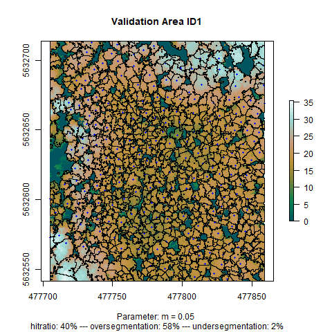

*Tree species biodiversity map.*

### What is it about?

Forests represent the most diverse habitat for different species around the globe.
Their monitoring is one of the most crucial task for biodiversity management.
Traditional means of monitoring forests are cost and labor intensive which lead
to a low revisit frequencies and small monitored areas. Additionally, the results
of data acquisitions by human agents make the results fairly reproducible. To
overcome these limitations, a LOEWE research project called [Natur4.0](https://www.uni-marburg.de/de/fb19/natur40) 
has been initiated between several German research institutes. A part of this project,
in which I participated in a student's seminar, analysis tree species and forest
structures by means of remote sensing techniques. 

### What it can do!

In this project I used RGB orthoimages and a point cloud derived from
Light Detection and Ranging (LiDAR) data to train a segmentation algorithm to
distinguish between individual trees based on a Canopy Height Model. This 
technique is based on a watershed algorithm which "grows" continues segments 
around a tree's central position to delineate the total tree crown.

Once the tree objects were generated an object-based supervised classification
of the tree species using a number of artificially created indices and filters of 
the RGB images and the Random Forest algorithm is feasible. Using the point cloud,
structural forest parameters, such as vegetation density, can be aggregated on
the level of individual trees and then analyzed. We see this result in the picture
above where I calculated the [_Shannon-Index_](https://www.rdocumentation.org/packages/vegan/versions/2.4-2/topics/diversity) 
based on the number of different tree species found in a circular 10 meters environment. Green colors show areas with a very low number of different species while
red colors indicate a relative species richness.

---

You can check out the results on a comprehensive [website](https://goergen95.github.io/mof_caldern/index.html)! You are also invited 
to read through the [code](https://github.com/goergen95/mof_caldern) for the analysis. 

