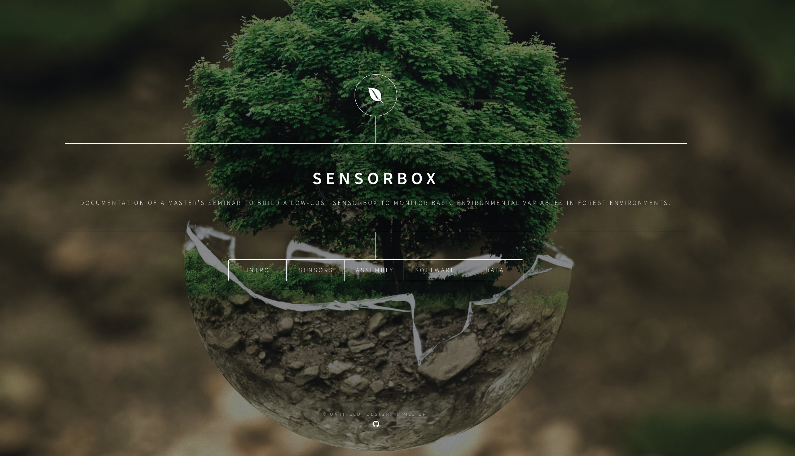

What is is about

This project website documents a master's seminar work at the University of 
Marburg on a fully automated, low-cost and self-build environmental sensor unit 
used in the LOEWE research project [Natur4.0](https://www.uni-marburg.de/de/fb19/natur40). 
Its core part is a Raspberry Pi 3 (Model B) equipped with sensors to measure 
incoming radiation, temperature and humidity as well as a camera and a microphone 
to take records of animals in forest environments. 

---

Core Components

- Raspberry Pi 3 (B)
- Raspberry Pi Camera Module v2.1
- SF-555 Microphone (Foxnovo)
- DHT22-AM2302 Temperature and Humidity Sensor
- TSL2591 High Dynamic Range Digital Light Sensor
- KY-024 Hall Sensors
- DS3231 Real-Time Clock
- PowerBank and Wirelss Charging Pads

---

What it does

The SensorBox is a fully automated sensing unit which can be used in conjunction
with a cable car mounted on specific trees to monitor environmental variables
on a vertical gradient within forest structures. There is a need to regularily 
charge the batteries on the ground station and in case of the presence of a WLAN
infrastructure the SensorBox is able to send the collected data to another station.
It can help to collect data on valuable parameters which might be used together
with remotley sensed imagery, e.g. by UAVs, to predict the spatial distribution 
of these parameters below the canopy cover. 

--- 

[Check it out](https://goergen95.github.io/sensorbox-docu) here or follow the 
link to [GitHub](https://github.com/goergen95/sensorbox-docu) to explore the 
source code of the website. Note, that the content shown here comes from a
student project and only covers the state of art during our two-week seminar.
Check out the [official documentation](https://nature40.github.io/Nature40DocumentationProject/) 
for more recent information.