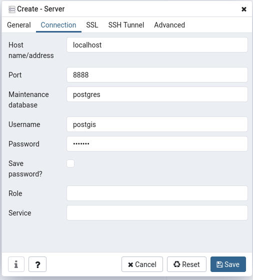

---
output:
 html_document:
   keep_md: true
---

In this tutorial I am going to show how you can use the docker engine to set up 
two containers, one hosting the [rocker/geospatial](https://hub.docker.com/r/rocker/geospatial) 
image and the other one the [postgis/postgis](https://hub.docker.com/r/postgis/postgis)
image. We will use docker-compose to start up both containers
so we can work with the r-spatial packages and postgis functionality simultaneously
in a stable environment.
I assume here that the necessary dependencies such as the [docker](https://docs.docker.com/get-docker/) and 
[docker-compose](https://docs.docker.com/compose/install/) engines are already met.


What we need is a simple .yaml file which defines the parameters of our application.
In the example I am going to demonstrate, the application consists of two services,
namely the postigs server and the R-Studio instance. We start with the postgres 
service by defining which images we are using. This image is found at [dockerhub](https://hub.docker.com/)
so in case the images are not found on the local machine they are pulled from there
once we run our application. We also make the naming of the container explicit by
using the _container_name_ option and set the restart behavior to _always_ in cases
the container breaks down. We also make sure to that the container will set up
a new user besides the default _postgres_ user by specifying a username and a password.
The last part specifies on the left hand the local path on the host machine where 
the database files are going to be written two, while the right hand part
links to the data directory within the postgis container.

```{yaml, eval=F}
services:
  postgres:
  image: postgis/postgis
  container_name: postgres
  restart: always
  environment:
    POSTGRES_USER: postgis
    POSTGRES_PASSWORD: postgis
  ports:
    - 8888:5432
  volumes:
    - ~/pgdata:/var/lib/postgresql/data

rstudio:
  image: rocker/geospatial
  container_name: r-studio
  restart: always
  environment:
    - USER=rstudio
    - PASSWORD=supersecret
    - ROOT=TRUE
  ports:
    - 8787:8787
  links: 
    - postgres
```

For the R-Studio service, we are using the geospatial image which comes in very
handy in cases you want to do geospatial analysis since a large number of important
packages already come preinstalled. We also make the naming of the container explicit
and set the restart behaviour to _always_. Since the rocker images are quite restrictive
when it comes to user rights management, in addition to specifying a user and a 
password we also want to enable root access in cases we need to install additional
software. This way our user is added to the sudoer list. However, this option
should be treated carefully. We also map a port on the host machine to the exposed
port of the container. This way we are able to reach the interface by simply 
accessing *http://localhost:8787/* in the browser of our choice. Finally, we declare
that the _posgres_ service is linked to the _rstudio_ service. This means that inside
the rstudio container an entry to _/etc/hosts_ called postgres is added linking
to the IP-address this container is found.

When we write the above configuration to a file called _docker-compose.yaml_ starting
the application is as simple as running the following command in a shell in the
same directory the file is found:

```{bash, eval=F}
docker-compose up
```

Once the services are up and running visit *http://localhost:8787/* and enter 
the username and password for the rstudio service. From here we can use the _RPostgreSQL_
and _RPostgres_ library to connect to our data base. In the simple example below,
we establish a connection and write a sf-Object shipped with the _sf_ package to the 
database.

```{r eval=FALSE}
library(RPostgreSQL)
library(RPostgres)
library(sf)

# specify connection inputs
db <- 'postgis'  # provide the name of your db
host_db = "postgres" # provide the name of the service
db_port = '5432'  # specify the port the service is available at
db_user = "postgis"  # specify username
db_password = "postgis" # specify password
# establish the connection
con <- dbConnect(Postgres(), 
                 dbname=db, 
                 host=host_db, 
                 port=db_port, 
                 user=db_user, 
                 password=db_password)

# read sample shapefile
shape = st_read(system.file("gpkg/nc.gpkg", package = "sf"))
# write to database in a new table specified by the layer argument
table_name = "test"
st_write(obj = shape, dsn = con, layer = table_name)

```

Since we mapped the data directory to a local directory on our host machine
the data we write into the database is persistent even when the application 
is no longer running. So to query, our database now or even after restarting the 
application we can use more sf functionality to interact with it.
Here is a simple example comparing dplyr syntax with the result we obtain from
querying the database to unify all polygons which have the same entry in the 'SID74' 
variable.

```{r, eval=F}
library(dplyr)

# dplyr way of 
shape_dplyr = shape %>%
  group_by(SID74) %>%
  summarise(AREA = sum(AREA, na.rm = TRUE))

shape_postgis = st_read(con, query = sprintf(paste0('SELECT "SID74", SUM("AREA") as "AREA", ST_UNION(geom) as geom \n',
                                    'FROM \"%s\" \n',
                                    'GROUP BY "SID74";')), table_name)
```

But how can we manage our postgis server now? There are two ways (well, actually
three ways I'll explain in a minute) how we can access the server. The first one is using psql from the host 
machine. In the configuration file we specified that the postgis containers port
is mapped to the hostmachines port 8888. Well, we simply use that information
to connect to the database using psql.

```{bash eval=F}
psql --host localhost --port 8888 --dbname postgres --user postgis
```

The command line will ask us for the password and then we are connected. 
Additionally, we can also chose to use a program with a graphical user interface
to manage the data base. One which ich highly recommend is [pgAdmin](https://www.pgadmin.org/).
After installing and running the program, we just have to specify a new connection.
After adding a name for the connection in the _General_ tab we switch to the
_Connection_ tab and fill in all the information as in the screenshot below.  



You already guessed the third option I promised you before? Well of course we can
use the psql approach explained above from the terminal in our R-Studio container.
Of course, the hostname will be slightly different, but the basic idea is the same.
Now, it comes in handy that we have root access in the R-Studio container, because
we are going to need to install external software first, namely the postgres client.
Thus we enter the following two lines into the terminal. Enter _Yes_ in case
you are asked if you wanted to install the software.

```{bash , eval=F}
sudo apt update
sudo apt install postgresql-client
```

Now our container has the psql command installed and we can use a slightly different
version of the above command to connect to the databse.

```{bash, eval=F}
psql --host postgres --port 5432 --dbname postgres --user postgis
```

What are the differences here? Well, first the container is not found at _localhost_
but as explained before we have got an entry in the _/etc/hosts_ file for our
container name _postgres_. Additionally, we are connecting directly to the container
and not to the mapped port on our host machine which is why we have to specify 5432
as the right port. Besides that, everything remains the same.

