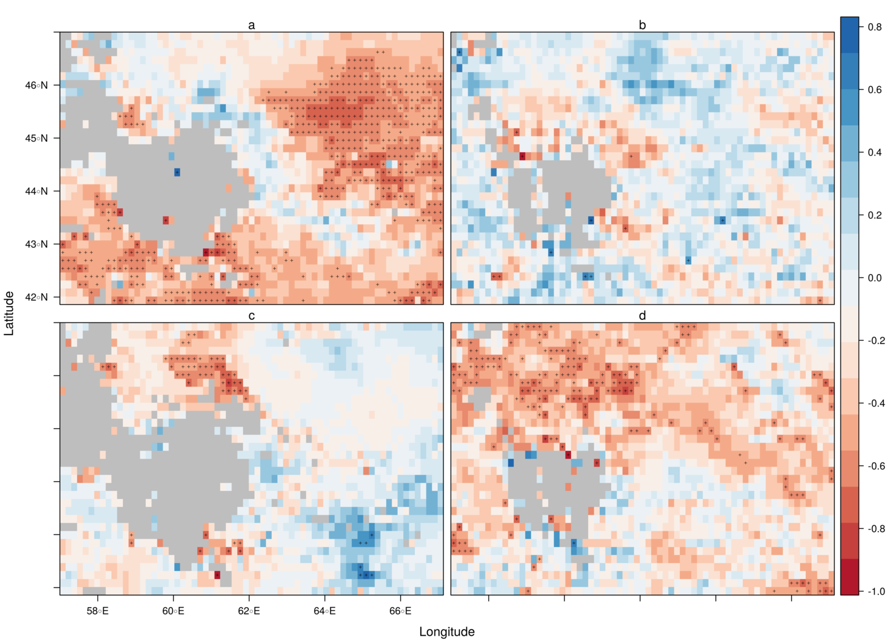

In this project I made use of the MODIS cloud (MOD/MYD06) and aerosol
(MOD/MYD04) products to investigate the relationship between cloud
micro-physics and aerosol loadings in the Aral Sea region. The terminal
lake of the two tributaries Syr Darya and Amu Darya has suffered from a
significant reduction of water inflow during the last two decades. This
led to the exposure of large portions of the sea’s surface which
nowadays is called the Aralkum dessert. The diffusion of dust and sand
particles in the area may not only threaten human health and
agricultural productivity, but it is assumed to impact the regional
hydrological cycle through the increase of aerosols in the atmosphere.

 (Source: NASA 2020)

------------------------------------------------------------------------

The interaction of aerosols with cloud micro-physics is very complex and
subject to inaccuracies as a result of limited observational capacity.
For example, from passive optical instruments aboard satellites it is
only possible to retrieve information on aerosols when clear-sky
conditions are met. Evidently, the opposite is true for cloud
parameters, rendering every analysis to significant differences at the
time scale between the measured properties of clouds and aerosols.
Additionally, the parameters which are derived are generalized for the
vertical column for every spatial unit, meaning we do not get any
information about the vertical distribution of aerosols.

------------------------------------------------------------------------

The mechanisms which govern the cloud-aerosol interactions mainly depend
on the type of aerosol, whether it acts hydrophilic or hydrophobic, and
its size. Some mechanisms are expected to suppress precipitation, while
others are suspected to lead to more severe and intense precipitation
events. To investigate the relationship to precipitation, the CHIRPS
dataset was used. This dataset uses satellite and ground observations to
retrieve rainfall rates at a monthly resolution. The cloud and aerosol
parameters were aggregated to the same spatial and temporal resolution
to allow some correlation analysis.

------------------------------------------------------------------------

During spring (a) and winter (d) a negative relationship between the
Aerosol Optical Depth (AOD) and precipitation rates (P) governs the
study area. During the other two seasons, we also see pixels with
positive correlations, however, these are not significant (pixels with a
significant correlation are marked by crosses). The analysis was done in
R and included data from 2003 to 2018 because since then both MODIS
satellites delivered products for the study area. The source code of the
complete project can be found in a [GitHub
repository](https://github.com/goergen95/aciASB), along with a more
elaborated
[discussion](https://github.com/goergen95/aciASB/blob/master/docs/report_II.pdf)
of the results.
