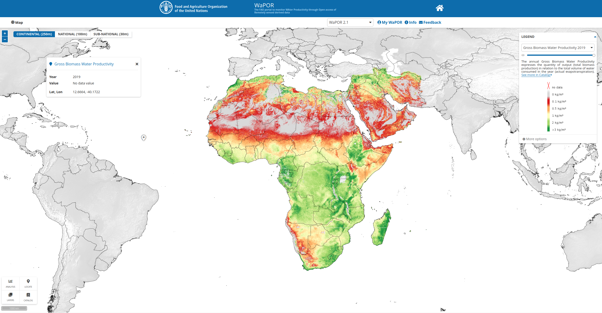

*Screenshot of from the
[WaPOR](https://wapor.apps.fao.org/home/WAPOR_2/1) website*

### What is it about?

The [WaPOR](https://wapor.apps.fao.org/home/WAPOR_2/1) project is a
project by FAO offering awesome remote sensing products concerned with
water usage in agriculture on the African continent. A great variety of
different products among them net and gross biomass water productivity,
data on evaporation, transpiration and interception as well as biomass
production are provided at a spatial resolution ranging between 250
meters for the whole continent to 30 meters for selected agricultural
regions.

There are already some Python packages out there which allow users to
programmatically access the WaPOR data portal such as
[hkvwaporpy](https://github.com/HKV-products-services/hkvwaporpy) or
[IHEWAwapor](https://github.com/wateraccounting/IHEWAwapor), however, I
was not able to find similar functionality for R users. So I just went
on and wrote an experimental package in R which can be used to download
raster data.

### What it can do?

To install and use the package you should use `remotes` functionality

``` r
if(!"wapoR" %in% installed.packages()[,1]){
  remotes::install_github("goergen95/wapoR")
}
library(wapoR)
```

From there it is quite straight forward to query available collections.
Note, that there are other collections present for which in general it
should be possible to download the data in the same way. But this
package was primarily intended to interact with the WaPOR collections.

``` r
cols = wapor_collections()
cols[rev(seq(1,nrow(cols),)),c(1:2)]
```

    ##             code
    ## 19          WPOP
    ## 18         WATER
    ## 17       WAPOR_2
    ## 16         WAPOR
    ## 15           RVF
    ## 14      RICCAR_2
    ## 13        RICCAR
    ## 12          RDMS
    ## 11          NMME
    ## 10 NATURAL_EARTH
    ## 9           NASA
    ## 8            GLW
    ## 7      GAEZ_2015
    ## 6        FAOSTAT
    ## 5           DLMF
    ## 4         CHIRPS
    ## 3        C2ATLAS
    ## 2           ASIS
    ## 1       AQUAMAPS
    ##                                                               caption
    ## 19                                                   WorldPop project
    ## 18                                                         Water Data
    ## 17                  FAO Water Productivity Open-access portal (WaPOR)
    ## 16                  FAO Water Productivity Open-access portal (WaPOR)
    ## 15                                                  Rift Valley Fever
    ## 14                     Regional Arab Climate Change Assessment Report
    ## 13                     Regional Arab Climate Change Assessment Report
    ## 12                                 Regional Drought Monitoring System
    ## 11                         North American Multi-Model Ensemble (NMME)
    ## 10                                                      Natural Earth
    ## 9                National Aeronautics and Space Administration (NASA)
    ## 8                                      Gridded Livestock of the World
    ## 7                                 Global Agro-Ecological Zones (2015)
    ## 6                                  FAO Corporate Statistical Database
    ## 5                            Desert Locust Monitoring and Forecasting
    ## 4  Climate Hazard group InfraRed Precipitation with Stations (CHIRPS)
    ## 3                                                Climate Change ATLAS
    ## 2                                     Agriculture Stress Index System
    ## 1                    Global spatial database on water and agriculture

I reversed the order of the collections vector so that you can see that
there are two available WaPOR collections representing version 1 and 2
respectively. I would advise using the more update version 2 if you do
not have other reasons to use the first version.

We can query the available products with in a collection by using
`wapor_products` together with he collection we wish to query.

``` r
prods = wapor_products(collection = "WAPOR_2")

print(paste0("In total there are ", length(prods), " available products in the WAPOR_2 collection."))
```

    ## [1] "In total there are 196 available products in the WAPOR_2 collection."

``` r
str(prods[1])
```

    ## List of 1
    ##  $ L1_GBWP_A:List of 2
    ##   ..$ product:'data.frame':  1 obs. of  3 variables:
    ##   .. ..$ code       : Factor w/ 1 level "L1_GBWP_A": 1
    ##   .. ..$ caption    : Factor w/ 1 level "Gross Biomass Water Productivity": 1
    ##   .. ..$ description: Factor w/ 1 level "The annual Gross Biomass Water Productivity expresses the quantity of output (total biomass production) in rela"| __truncated__: 1
    ##   ..$ meta   :'data.frame':  1 obs. of  12 variables:
    ##   .. ..$ format                : Factor w/ 1 level "Raster Dataset": 1
    ##   .. ..$ unit                  : Factor w/ 1 level "kg/m³ is the ratio of kg of dry matter per cubic meter of water transpired by vegetation in one hectare": 1
    ##   .. ..$ dataType              : Factor w/ 1 level "Int32 (32bit Integer)": 1
    ##   .. ..$ conversionFactor      : Factor w/ 1 level "the pixel value in the downloaded data must be multiplied by 0.001": 1
    ##   .. ..$ noDataValue           : int -9999
    ##   .. ..$ spatialResolution     : Factor w/ 1 level "250m (0.00223 degree)": 1
    ##   .. ..$ spatialExtent         : Factor w/ 1 level "Africa and Near East": 1
    ##   .. ..$ spatialReferenceSystem: Factor w/ 1 level "EPSG:4326 - WGS84 - Geographic Coordinate System (lat/long)": 1
    ##   .. ..$ temporalResolution    : Factor w/ 1 level "from January 2009 to present": 1
    ##   .. ..$ temporalExtent        : Factor w/ 1 level "Annual": 1
    ##   .. ..$ nearRealTime          : Factor w/ 1 level "New dekadal data layers are released approximately 5 days after the end of a dekad. A higher quality version of"| __truncated__: 1
    ##   .. ..$ methodology           : Factor w/ 1 level "The calculation of gross biomass water productivity (GBWP) is as follows: GBWP = TBP/ETIa Where TBP is annual T"| __truncated__: 1

``` r
names(prods)[1:10]
```

    ##  [1] "L1_GBWP_A" "L1_NBWP_A" "L1_AETI_A" "L1_AETI_M" "L1_AETI_D"
    ##  [6] "L1_T_A"    "L1_E_A"    "L1_I_A"    "L1_T_D"    "L1_E_D"

The total number of products is quite high. The product names are
consist first of the level a respective product belongs to. Level 1
means this product belongs to the continental products covering the
African continent at a spatial resolution of about 250 meters. Level 2
product show a resolution of 100 meters, however, they are only
available for selected countries. Finally, level 3 data is available for
only a few specific agricultural regions but the spatial resolution is
about 30 meters.

The second component in the product name specifies the variable. For
example, GBWP stands for **G**ross **B**iomass **W**ater
**P**roductivity or AETI for **A**ctual **E**vapo**t**ranspiraton and
**I**nterception. You can check out the [WaPOR
catalog](https://wapor.apps.fao.org/catalog/WAPOR_2/1) to see all
available products, or you search through the product list as some
metadata is also included in the above object.

The last component of a product name specifies its temporal resolution
where A stands for annual, M for monthly, D for decadal and S for a
seasonal temporal resolution.

Let’s assume we decided to download some level 3 data for the Office du
Niger agricultural region. First let’s take a look at the available
products:

``` r
names(prods)[grep("L3_ODN", names(prods))]
```

    ##  [1] "L3_ODN_AETI_A"       "L3_ODN_AETI_M"       "L3_ODN_AETI_D"      
    ##  [4] "L3_ODN_T_A"          "L3_ODN_E_A"          "L3_ODN_I_A"         
    ##  [7] "L3_ODN_T_D"          "L3_ODN_E_D"          "L3_ODN_I_D"         
    ## [10] "L3_ODN_NPP_D"        "L3_ODN_LCC_D"        "L3_ODN_TBP_S"       
    ## [13] "L3_ODN_PHE_S"        "L3_ODN_QUAL_LCC_S"   "L3_ODN_QUAL_NDVI_D" 
    ## [16] "L3_ODN_QUAL_NDVI_LT"

For the sake of a quick example, let’s say we are interested in the
actual evapotranspiration and interception for the year 2018. We can
query some additional metadata about this product with the following
command:

``` r
meta = wapor_metadata(collection = "WAPOR_2", product = "L3_ODN_AETI_A")
str(meta)
```

    ## List of 3
    ##  $ info      :'data.frame':  1 obs. of  5 variables:
    ##   ..$ code      : Factor w/ 1 level "WATER_MM": 1
    ##   ..$ caption   : Factor w/ 1 level "Amount of Water": 1
    ##   ..$ unit      : Factor w/ 1 level "mm": 1
    ##   ..$ scale     : int 3
    ##   ..$ multiplier: num 0.1
    ##  $ dimensions:'data.frame':  1 obs. of  3 variables:
    ##   ..$ code   : Factor w/ 1 level "YEAR": 1
    ##   ..$ caption: Factor w/ 1 level "Year": 1
    ##   ..$ type   : Factor w/ 1 level "TIME": 1
    ##  $ meta      :'data.frame':  1 obs. of  12 variables:
    ##   ..$ format                : Factor w/ 1 level "Raster Dataset": 1
    ##   ..$ unit                  : Factor w/ 1 level "mm": 1
    ##   ..$ dataType              : Factor w/ 1 level "Int32 (32bit Integer)": 1
    ##   ..$ conversionFactor      : Factor w/ 1 level "the pixel value in the downloaded data must be multiplied by 0.1": 1
    ##   ..$ noDataValue           : int -9999
    ##   ..$ spatialResolution     : Factor w/ 1 level "30m": 1
    ##   ..$ spatialExtent         : Factor w/ 1 level "Office du Niger, Mali": 1
    ##   ..$ spatialReferenceSystem: Factor w/ 1 level "EPSG:32630 - WGS 84 / UTM zone 30N": 1
    ##   ..$ temporalResolution    : Factor w/ 1 level "from January 2009 to present": 1
    ##   ..$ temporalExtent        : Factor w/ 1 level "Annual": 1
    ##   ..$ nearRealTime          : Factor w/ 1 level "New dekadal data layers are released approximately 5 days after the end of a dekad. A higher quality version of"| __truncated__: 1
    ##   ..$ methodology           : Factor w/ 1 level "See ETIa by dekad for further information. The annual total is obtained by taking the ETIa in mm/day, multiplyi"| __truncated__: 1

From the above we already get a lot of useful information. For example
we see that the product is available between 2009 and the present year
and is provided in a projected coordinate reference system. We also can
see that the unit of the pixel values is in millimeters bit that the
pixel value shall be multiplied with a scale factor of 0.1. This is very
important information and it should be checked for all WaPOR products
since most of them were rescaled in order to reduce file size.

Maybe the most important aspect of above output for the next step which
is downloading is the dimensions dataframe. Here we can see that the
selected product only shows one dimensions which is called “YEAR” and
which’s type is time. Other products might have further dimensions such
as “SEASON” which needs further specification in the download call.

``` r
wapor_queryRaster(collection = "WAPOR_2",
                  product = "L3_ODN_AETI_A",
                  begin = "2018-01-01", # begin date is inclusive
                  end = "2019-01-01", # end date is exclusive
                  outdir = "assets/files/",
                  APIkey = Sys.getenv("wapor-key")) 
```

Let’s take a glimpse at the data we just downloaded.

``` r
library(raster)
```

    ## Loading required package: sp

``` r
file = list.files("../assets/files/", "L3_ODN", full.names = T)
r = raster(file) * 0.1
plot(r)
```

<!-- -->

We very quickly downloaded some important data for an assessment of
agricultural practices in ODN. The download functionality provided by
this package can be used to download specific regions from Level 2 or 3
datasets by providing an sf object of an area of interest. Additionally
complete time series can be downloaded by adapting the start and end
date. Check out the [README](https://github.com/goergen95/wapoR) of the
package for another example to download some data and leave an issue if
you face any problems while using this package.
